# botlockbox

`botlockbox` is a credential-injecting HTTPS/HTTP MITM proxy for AI agents, MCP servers, and CLI tools. It sits between your agents and external APIs, decrypting `age`-encrypted secrets in memory and injecting them transparently into outbound requests. Callers -- including agents with root shell access -- **never see the credentials**.

## Architecture

```
+-----------------------------------------------------+
|  AI Agent / MCP Server / CLI Tool                   |
|  (zero credentials, uses http_proxy=localhost:8080) |
+----------------------+------------------------------+
                       |
                       | plain request (no creds)
                       v
+-----------------------------------------------------+
|  botlockbox proxy (localhost:8080)                  |
|  - decrypts secrets in memory (age + memguard)      |
|  - validates sealed host allowlist                  |
|  - injects Authorization / API headers              |
|  - verifies upstream TLS (anti-DNS-rebinding)       |
|  - scrubs credentials from responses                |
|  - writes structured audit log (JSONL)              |
+----------------------+------------------------------+
                       |
                       | request + injected credentials
                       v
             External API (GitHub, OpenAI, AWS...)
```

## Security model

| # | Attack vector | Mitigation | Layer |
|---|--------------|-----------|-------|
| 1 | Read `/proc/<pid>/mem` | `PR_SET_DUMPABLE=0` | OS |
| 2 | `ptrace` attach | `PR_SET_DUMPABLE=0` + separate UID | OS |
| 3 | Secrets swapped to disk | `mlockall` + `MADV_DONTDUMP` | OS |
| 4 | Core dump contains secrets | `setrlimit(RLIMIT_CORE,0)` + `MADV_DONTDUMP` | OS |
| 5 | GC copies secrets in heap | `memguard` encrypted enclave | App |
| 6 | MITM CA key readable on disk | Ephemeral in-memory ECDSA CA, never written to disk | App |
| 7 | Config tampered to add a new host | Sealed envelope validation at startup -- hard `os.Exit(1)` | App |
| 8 | Config tampered to bypass at runtime | Per-injection sealed allowlist check in injector | App |
| 9 | DNS rebinding past host check | Upstream TLS certificate verification | App |
| 10 | Response body leaks tokens | Response scrubber redacts known credential patterns | App |
| 11 | Prompt injection edits config + restart | Config set `0444` post-seal + envelope validation on next start | App+OS |
| 12 | Silent credential exfiltration | Structured JSONL audit log (secret names only, never values) | App |
| 13 | Swap / hibernate writes memory to disk | `mlockall` | OS |
| 14 | Brute-force the encrypted blob | `age` X25519 / scrypt -- computationally infeasible | Crypto |
| 15 | Binary replacement (swap botlockbox) | OS file integrity monitoring (separate ops concern) | Ops |

## Installation

```bash
go install github.com/trodemaster/botlockbox@latest
```

Or build from source:

```bash
git clone https://github.com/trodemaster/botlockbox
cd botlockbox
make build
# binary at bin/botlockbox
```

## Quick start

### 1. Generate an age key pair (one time)

```bash
age-keygen -o ~/.age/identity.txt
# Public key printed to stdout: age1xxxxxxxxxx
```

### 2. Write your config (no secrets here)

```bash
cp botlockbox.yaml ~/.config/botlockbox.yaml
# edit rules as needed
```

### 3. Seal your secrets

```bash
cat <<EOF | botlockbox seal \
  --config ~/.config/botlockbox.yaml \
  --identity ~/.age/identity.txt
github_token: "ghp_xxxxxxxxxxxxxxxxxxxx"
openai_key: "sk-xxxxxxxxxxxxxxxxxxxx"
EOF
# Secrets sealed to ~/.botlockbox/secrets.age
# Config set to read-only (0444)
```

### 4. Start the proxy

```bash
botlockbox serve \
  --config ~/.config/botlockbox.yaml \
  --identity ~/.age/identity.txt
# Host binding verified
# botlockbox listening on 127.0.0.1:8080
```

### 5. Use it -- callers need zero credentials

```bash
http_proxy=http://127.0.0.1:8080 \
https_proxy=http://127.0.0.1:8080 \
  curl https://api.github.com/user
# Authorization: Bearer ghp_xxx injected transparently
```

---

## Deployment modes

### Mode 1: Mac persistent proxy with Secure Enclave key

Use [`age-plugin-se`](https://github.com/remko/age-plugin-se) to bind `secrets.age` to a specific Mac's Secure Enclave. The private key is generated inside the chip and **cannot be exported or used on any other machine**. With `--access-control none`, decryption is silent — no Touch ID prompt — making it suitable for a `launchd` user-session agent that starts at login.

```mermaid
flowchart TD
    subgraph setup["One-time setup"]
        direction LR
        KG["age-plugin-se keygen<br/>--access-control none"]
        SE["Secure Enclave<br/>T2 / M-series"]
        SE -->|"generates and stores private key in hardware"| KG
        KG -->|"identity reference (AGE-PLUGIN-SE-1…)"| IDFILE["~/.botlockbox/identity.txt"]
        KG -->|"public key (age1se1q…)"| SEAL
        CREDS["credentials<br/>(stdin, plaintext)"] --> SEAL["botlockbox seal<br/>--recipient age1se1q…"]
        SEAL -->|"device-bound ciphertext"| SAGE["secrets.age"]
    end

    subgraph runtime["Every login — launchd user-session agent"]
        direction LR
        LAUNCHD["launchd"] -->|"starts at login, KeepAlive: true"| SERVE["botlockbox serve<br/>--identity identity.txt"]
        IDFILE -->|"identity ref"| SERVE
        SAGE -->|"ciphertext"| SERVE
        SERVE -->|"decrypts silently, no Touch ID"| MEM["secrets in<br/>memguard enclaves"]
        AGENT["AI agent / MCP / CLI<br/>no credentials"] -->|"HTTPS_PROXY=localhost:8080"| SERVE
        SERVE -->|"Authorization injected from enclave"| API["External API"]
    end

    SAGE -.->|"useless on any other Mac"| LOCK["🔒 device-bound"]
```



**One-time setup:**

```bash
# Install age-plugin-se (e.g. via Homebrew)
brew install age-plugin-se

# Generate a key bound to this Mac's Secure Enclave (no Touch ID at runtime)
age-plugin-se keygen --access-control none -o ~/.botlockbox/identity.txt
# note the "public key: age1se1q..." line

# Seal your credentials to that public key
printf 'openai_key: "sk-xxxx"\ngithub_token: "ghp_xxxx"\n' \
  | botlockbox seal \
      --config ~/.botlockbox/botlockbox.yaml \
      --recipient age1se1q...
```

**Install as a launchd user-session agent** (see `contrib/com.trodemaster.botlockbox.plist` for the full template):

```bash
# Edit the plist to set your username and paths, then:
cp contrib/com.trodemaster.botlockbox.plist ~/Library/LaunchAgents/
launchctl load ~/Library/LaunchAgents/com.trodemaster.botlockbox.plist
```

The proxy starts at every login. `secrets.age` and `identity.txt` are useless on any other Mac — hardware binding without prompts.

**Rotating a secret:**

```bash
# Re-seal with the new credential value
printf 'openai_key: "sk-new"\ngithub_token: "ghp_xxxx"\n' \
  | botlockbox seal \
      --config ~/.botlockbox/botlockbox.yaml \
      --recipient age1se1q...

# Hot-reload the running proxy (no restart, zero dropped connections)
botlockbox reload --pidfile ~/.botlockbox/botlockbox.pid
```

---

### Mode 2: GitHub Actions self-hosted runner (ephemeral key)

The runner hosts AI agents that call external APIs. Credentials live in GitHub Actions secrets and are never placed in agent environment variables. An ephemeral age key is generated fresh for each workflow run and piped directly to `botlockbox serve` via `--identity-stdin` — **the private key never touches disk**.

```mermaid
flowchart TD
    subgraph gha["GitHub Actions workflow — self-hosted runner"]
        direction TB

        subgraph setup["Job startup (root / botlockbox user)"]
            GHS["GitHub Actions secrets<br/>OPENAI_KEY, GITHUB_TOKEN…"]
            KEYGEN["age-keygen<br/>ephemeral keypair"]
            PUBKEY["public key<br/>shell variable only"]
            PRIVKEY["private key<br/>shell variable only"]
            KEYGEN --> PUBKEY
            KEYGEN --> PRIVKEY
            GHS --> SEAL["botlockbox seal<br/>--recipient $PUBKEY"]
            PUBKEY --> SEAL
            SEAL --> SAGE["secrets.age<br/>run-scoped"]
            PRIVKEY -->|"piped via stdin"| SERVE["botlockbox serve<br/>--identity-stdin"]
            SAGE --> SERVE
            SERVE -->|"decrypts, scrambles key buffer"| MEM["secrets in<br/>memguard enclaves"]
        end

        subgraph run["Agent execution (unprivileged user)"]
            AGENT["AI agent<br/>uid: agent"]
            AGENT -->|"HTTPS_PROXY=localhost:8080, no credentials in env"| SERVE
            SERVE -->|"Authorization injected from enclave"| API["External API"]
        end
    end

    KEYGEN -.->|"shell vars gone after step exits"| GONE["🗑 ephemeral"]
    SERVE -.->|"no identity.txt on disk"| NOFILE["no key on disk"]
```



**Workflow pattern:**

```yaml
jobs:
  run-agent:
    runs-on: [self-hosted, linux]
    steps:
      - uses: actions/checkout@v4

      - name: Start botlockbox (key never touches disk)
        env:
          OPENAI_KEY: ${{ secrets.OPENAI_KEY }}
        run: |
          # Generate a fresh ephemeral keypair for this run
          IDENTITY=$(age-keygen)
          PUBKEY=$(echo "$IDENTITY" | grep '# public key:' | awk '{print $NF}')

          # Seal the credentials to the ephemeral public key
          printf 'openai_key: "%s"\n' "$OPENAI_KEY" \
            | botlockbox seal --config botlockbox.yaml --recipient "$PUBKEY"

          # Pipe the private key directly to serve — never written to disk
          echo "$IDENTITY" | botlockbox serve \
            --config botlockbox.yaml \
            --identity-stdin \
            --ca-cert /tmp/botlockbox-ca.pem \
            --pidfile /tmp/botlockbox.pid &

          # Trust the ephemeral CA so agent tools can verify TLS
          sudo cp /tmp/botlockbox-ca.pem /usr/local/share/ca-certificates/botlockbox.crt
          sudo update-ca-certificates

      - name: Run agent (no credentials in environment)
        run: |
          HTTPS_PROXY=http://127.0.0.1:8080 python agent.py
```

**What this protects against:**

| Threat | Without botlockbox | With botlockbox |
|--------|-------------------|-----------------|
| Agent reads `$OPENAI_KEY` from env | ✗ exposed | ✓ not in env |
| Agent reads credentials from disk | ✗ if written to file | ✓ never on disk |
| Agent logs or exfiltrates request body | ✗ credential visible | ✓ scrubbed from responses |
| Leaked `secrets.age` file after run | ✗ decryptable with key | ✓ key is ephemeral, gone after job |
| Agent calls an unlisted host | ✗ no enforcement | ✓ sealed allowlist blocks injection |

**Process isolation (recommended):**

For stronger isolation, run botlockbox as a privileged user and the agent as a separate unprivileged user. The agent can reach the proxy over TCP but cannot read botlockbox's memory or files.

```
uid 0 / botlockbox: botlockbox serve --identity-stdin ...
uid 1001 / agent:   HTTPS_PROXY=http://127.0.0.1:8080 python agent.py
```

In Docker, this is a two-stage entrypoint: start the proxy as root, then `exec su -c "python agent.py" agent`.

---

### Mode 3: MCP containers on a Mac host (Docker Compose)

Run MCP servers in Docker containers while botlockbox provides credential injection from the Mac host. The containers carry **zero credentials** — all `Authorization` headers are injected by botlockbox before requests reach external APIs.

This works with any MCP server that respects standard HTTP proxy environment variables. No changes to MCP server images are required.

```mermaid
flowchart TD
    subgraph mac["Mac Host"]
        SE["Secure Enclave<br/>(age-plugin-se)"]
        BLB["botlockbox<br/>0.0.0.0:8080<br/>(launchd agent)"]
        CAPEM["~/.botlockbox/ca.pem"]
        SE -->|"decrypts silently"| BLB
        BLB -->|"--ca-cert"| CAPEM
    end

    subgraph docker["Docker Desktop (bridge network)"]
        MCP1["MCP server A<br/>(Python)"]
        MCP2["MCP server B<br/>(Node.js)"]
        MCP1 & MCP2 -->|"volume mount :ro"| VOL["/etc/botlockbox/ca.pem"]
    end

    CAPEM -->|"bind mount"| VOL

    MCP1 -->|"HTTPS_PROXY=host.docker.internal:8080"| BLB
    MCP2 -->|"HTTPS_PROXY=host.docker.internal:8080"| BLB
    BLB -->|"Authorization injected from enclave"| API["External APIs<br/>OpenAI, GitHub…"]
```



**Prerequisites:**

1. botlockbox running on the Mac host (Mode 1 — launchd + Secure Enclave).
2. `listen: "0.0.0.0:8080"` in `botlockbox.yaml` — the default `127.0.0.1` is unreachable from Docker's bridge network.
3. CA cert written to `~/.botlockbox/ca.pem` via `--ca-cert ~/.botlockbox/ca.pem` in the launchd plist.

**Docker Compose config** (full template in `contrib/docker-compose.example.yml`):

```yaml
x-botlockbox-proxy: &botlockbox-proxy
  HTTP_PROXY:  "http://host.docker.internal:8080"
  HTTPS_PROXY: "http://host.docker.internal:8080"
  http_proxy:  "http://host.docker.internal:8080"
  https_proxy: "http://host.docker.internal:8080"
  NO_PROXY: "localhost,127.0.0.1,*.local"

x-botlockbox-ca: &botlockbox-ca
  REQUESTS_CA_BUNDLE: /etc/botlockbox/ca.pem   # Python (requests, httpx, boto3, openai-sdk)
  NODE_EXTRA_CA_CERTS: /etc/botlockbox/ca.pem  # Node.js
  SSL_CERT_FILE: /etc/botlockbox/ca.pem        # Go stdlib, Ruby net/http
  CURL_CA_BUNDLE: /etc/botlockbox/ca.pem       # curl / libcurl

services:
  mcp-server:
    image: your-mcp-server-image:latest
    environment:
      <<: [*botlockbox-proxy, *botlockbox-ca]
      # No API keys here — botlockbox injects them.
    volumes:
      - "${HOME}/.botlockbox/ca.pem:/etc/botlockbox/ca.pem:ro"
    extra_hosts:
      - "host.docker.internal:host-gateway"  # needed on Linux Docker; harmless on Mac
```

**How it works:**

1. Docker Desktop resolves `host.docker.internal` to the Mac host IP automatically.
2. `HTTPS_PROXY` causes the container's HTTP library to tunnel all HTTPS through botlockbox.
3. botlockbox MITMs the TLS session with its ephemeral CA, injects the credential from the Secure Enclave, and forwards the request.
4. The CA cert is mounted read-only from the Mac host; each language runtime trusts it via its own env var — no code changes, no image rebuilds.

**The MCP server's perspective:** it makes a normal HTTPS call to `api.openai.com`. The response arrives and credentials were never in its environment.

---

## CLI reference

### `botlockbox seal`

Reads plaintext secrets from stdin, binds them to the host allowlist derived from the config, and writes an `age`-encrypted envelope to `secrets_file`. Also sets the config to read-only (`0444`) to prevent post-seal tampering.

```
botlockbox seal --config <path> (--identity <path> | --recipient <pubkey>)
```

| Flag | Default | Description |
|------|---------|-------------|
| `--config` | `botlockbox.yaml` | Path to `botlockbox.yaml` |
| `--identity` | — | Path to an age X25519 identity file; derives the recipient from the key. Mutually exclusive with `--recipient`. |
| `--recipient` | — | Age public key string (`age1…` or `age1se1…`). Use this for plugin keys such as `age-plugin-se`. Mutually exclusive with `--identity`. |

Exactly one of `--identity` or `--recipient` is required.

**Stdin format** — YAML key/value pairs:

```yaml
github_token: "ghp_xxxxxxxxxxxxxxxxxxxx"
openai_key: "sk-xxxxxxxxxxxxxxxxxxxx"
```

Every secret name referenced in a `{{secrets.NAME}}` template in the config must be present on stdin. Missing secrets are a hard error.

**Re-sealing** — run `seal` again any time you rotate a secret or add a new host to the config. The previous `secrets.age` is overwritten atomically.

---

### `botlockbox serve`

Decrypts the sealed envelope, validates it against the live config, loads secrets into locked memory, and starts the MITM proxy.

```
botlockbox serve --config <path> (--identity <path> | --identity-stdin) [flags]
```

| Flag | Default | Description |
|------|---------|-------------|
| `--config` | `botlockbox.yaml` | Path to `botlockbox.yaml` |
| `--identity` | — | Path to an age identity file. Mutually exclusive with `--identity-stdin`. |
| `--identity-stdin` | `false` | Read age identity from stdin; the key is never written to disk. Mutually exclusive with `--identity`. |
| `--pidfile` | — | Write the proxy PID here; used by `botlockbox reload`. |
| `--ca-cert` | — | Write the ephemeral MITM CA public certificate PEM here so clients can trust it. |

Exactly one of `--identity` or `--identity-stdin` is required.

**Startup sequence:**

1. Load and parse `botlockbox.yaml`
2. Decrypt `secrets_file` using the age identity
3. Validate the sealed envelope against the live config — any secret or host present in the config that was not committed at seal time causes an immediate `os.Exit(1)`
4. Load each secret into a `memguard` encrypted enclave; scramble the plaintext bytes immediately
5. Apply OS hardening (`PR_SET_DUMPABLE=0`, `mlockall`, `RLIMIT_CORE=0` on Linux)
6. Generate an ephemeral in-memory ECDSA P-256 MITM CA (24 h lifetime, never written to disk)
7. Write CA cert PEM and PID file if requested
8. Begin accepting connections

---

### `botlockbox reload`

Sends SIGHUP to a running `serve` process, triggering a live secret reload. The proxy keeps serving with old secrets if the reload fails for any reason.

```
botlockbox reload --pidfile <path>
```

| Flag | Default | Description |
|------|---------|-------------|
| `--pidfile` | _(required)_ | Path to the PID file written by `botlockbox serve`. |

---

## Config reference

| Field | Type | Default | Description |
|-------|------|---------|-------------|
| `listen` | string | `127.0.0.1:8080` | Proxy listen address |
| `secrets_file` | string | `~/.botlockbox/secrets.age` | Path to age-encrypted secrets |
| `verbose` | bool | `false` | Log every proxied request |
| `rules` | list | — | Credential injection rules |
| `rules[].name` | string | — | Human-readable rule name (appears in audit log) |
| `rules[].match.hosts` | list | — | Host glob patterns (`*.example.com` supported) |
| `rules[].match.path_prefixes` | list | — | Optional URL path prefix filters |
| `rules[].inject.headers` | map | — | Request headers to inject; supports `{{secrets.NAME}}` |
| `rules[].inject.query_params` | map | — | Query parameters to inject; supports `{{secrets.NAME}}` |

## Secrets file format

Provided via stdin to `botlockbox seal` only -- **never written to disk in plaintext**:

```yaml
github_token: "ghp_xxxxxxxxxxxxxxxxxxxx"
openai_key: "sk-xxxxxxxxxxxxxxxxxxxx"
aws_session_token: "IQoJb3..."
```

The only artifact written to disk is `secrets.age` -- an opaque `age`-encrypted blob.

## Deployment posture

```
+---------------------------------------------+
|  Container / VM                             |
|                                             |
|  uid 1001: botlockbox serve                 |
|    - secrets.age   (0600, owned by 1001)    |
|    - identity.txt  (0600, owned by 1001)    |
|    - botlockbox.yaml (0444, read-only)      |
|    - PR_SET_DUMPABLE=0                      |
|    - mlockall                               |
|    - RLIMIT_CORE=0                          |
|                                             |
|  uid 1002: AI agent / MCP server            |
|    - http_proxy=http://127.0.0.1:8080       |
|    - NO access to uid 1001 files            |
|    - NO ptrace capability on uid 1001       |
|                                             |
|  Egress firewall: only allowlisted hosts    |
+---------------------------------------------+
```

## Building

```bash
make build    # compile to bin/botlockbox
make install  # go install
make test     # go test -race ./...
make lint     # go vet ./...
make tidy     # go mod tidy
```

## License

MIT
